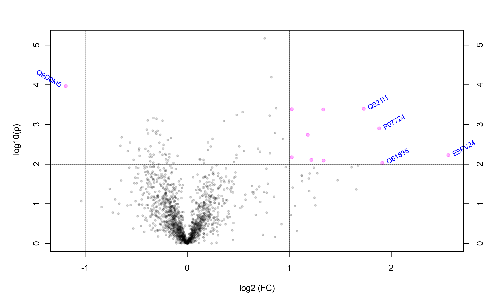
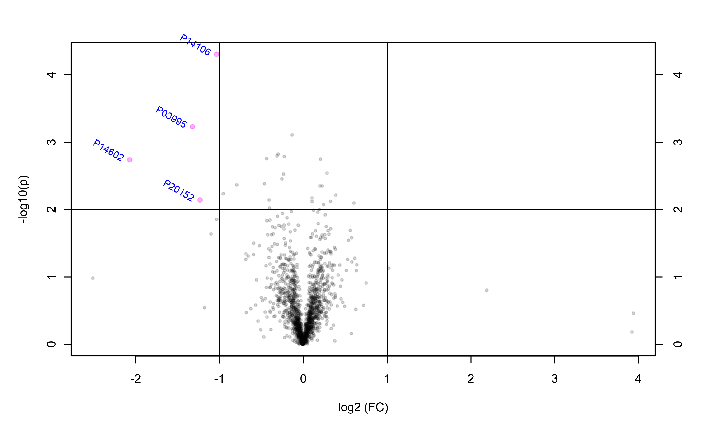

# Results

 ## Fold Change

The following tables present the fold change information about the significant proteins (p < 0.01). Up or down regulation is addressed with `green` and `red` for up and down regulated expression level in the `color` columns.

* ###  KA-NoSurgery vs. KA-NoSurgery

Fold change is estimated based on the assumption that `KA-NoSurgery` condition is the control. The table is also accessible from [here](FoldChange/KA_NoSurgery.vs.Ka_Surgery.md).

* ### KA-NoSurgery vs. Vehicle-NoSrugery

Fold change is estimated based on the assumption that `KA-NoSurgery` condition is the control. The table is also accessible from [here](FoldChange/KA_NoSurgery.vs.Vehicle_NoSurgery.md).

* ### KA-Surgery vs. Vehicle-Surgery

Fold change is estimated based on the assumption that `KA-Surgery` condition is the control. The table is also accessible from [here](FoldChange/KA_Surgery.vs.Vehicle_Surgery.md).

* ### Vehicle-Surgery vs. Vehicle-NoSurgery

Fold change is estimated based on the assumption that `Vehicle-Surgery` condition is the control. The table is also accessible from [here](FoldChange/Vehicle_NoSurgery.vs.Vehicle_Surgery.md).

## Heat Map

Heat map is generated for significant proteins (P < 0.05). No clustering have been performed among samples.

* ###  KA-NoSurgery vs. KA-Surgery

* ### KA-NoSurgery vs. Vehicle-NoSrugery

* ### KA-Surgery vs. Vehicle-Surgery

* ### Vehicle-Surgery vs. Vehicle-NoSurgery

## Volcano Plot
In the following volcano plots, statistical significance is plotted agains the fold change. Proteins that are both significant (p < 0.05, negLOG10 (p) > 2) and their expression level has changed more than 2 folds ( log2(fc) > 2 for upper expressed and log2(fc) < 2 for lower expressed proteins ) are shown in pink.

* ###  KA-NoSurgery vs. KA-Surgery

* ### KA-NoSurgery vs. Vehicle-NoSrugery

* ### KA-Surgery vs. Vehicle-Surgery

* ### Vehicle-Surgery vs. Vehicle-NoSurgery

